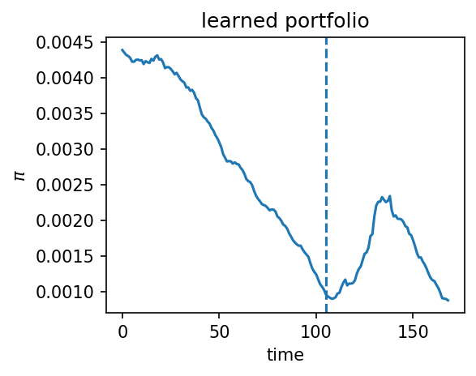
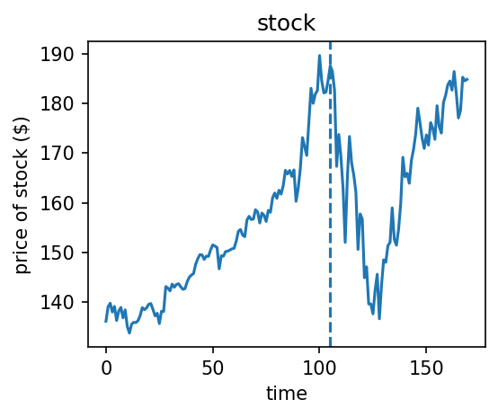

# ICAIF 2022 Data Augmentation for Portfolio Construction
This github respository is for our ICAIF 2022 paper "Theoretically Motivated Data Augmentation and Regularization for Portfolio Construction," see the full version of our paper on arxiv:
https://arxiv.org/abs/2106.04114


We include a demonstration implementation and application of the proposed method to learning a portfolio during the 2020 Market Crash. See the file `demonstration_market_crash.ipynb`

The code in `main.py` can be used to grid search over different parameters for all stocks.

# Data
To obtain the S&P500 data we used, change the directory to `./data`, use the following command, and extract the `csv` file:
```
wget https://github.com/pfnet-research/Finance_data_augmentation_ICAIF2022/releases/download/data/sp500.zip
```


# A case study of the proposed method
The following figures shows portfolio constructed by our neural network model of MSFT (Microsoft) during the 2020 stock market crash (see https://en.wikipedia.org/wiki/2020_stock_market_crash). The vertical dashed line shows the data of the market crash.

The price of the stock:




The constructed portfolio:



As we see, the model avoids the crash quite well. The demonstration code for training and testing this model is here in the jupyter notebook file `demonstration_market_crash.ipynb`.  


